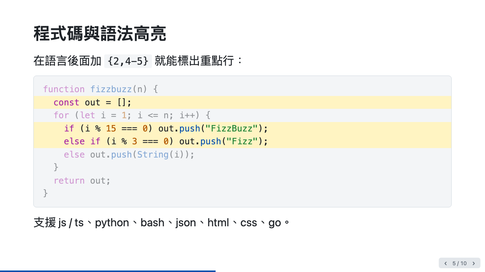
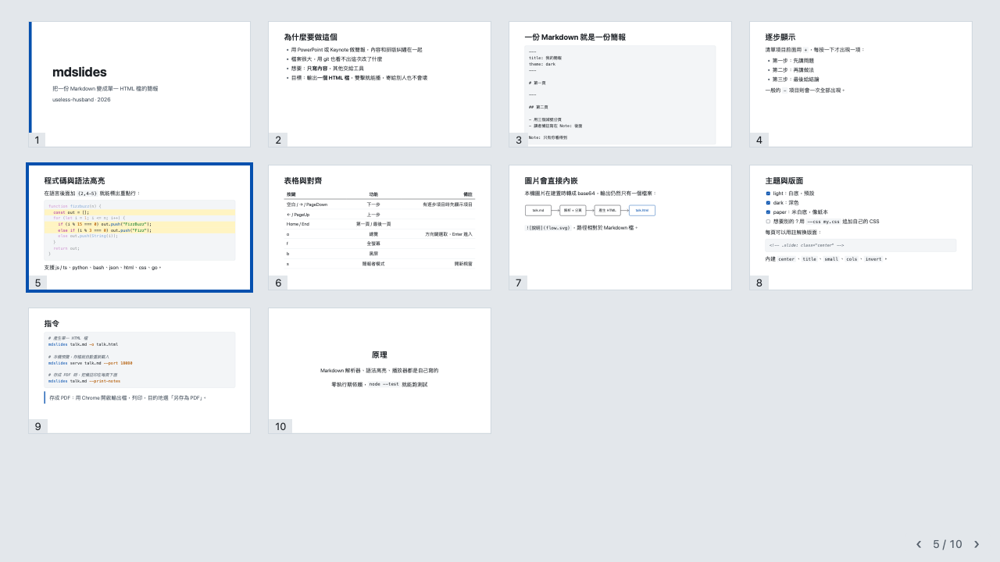
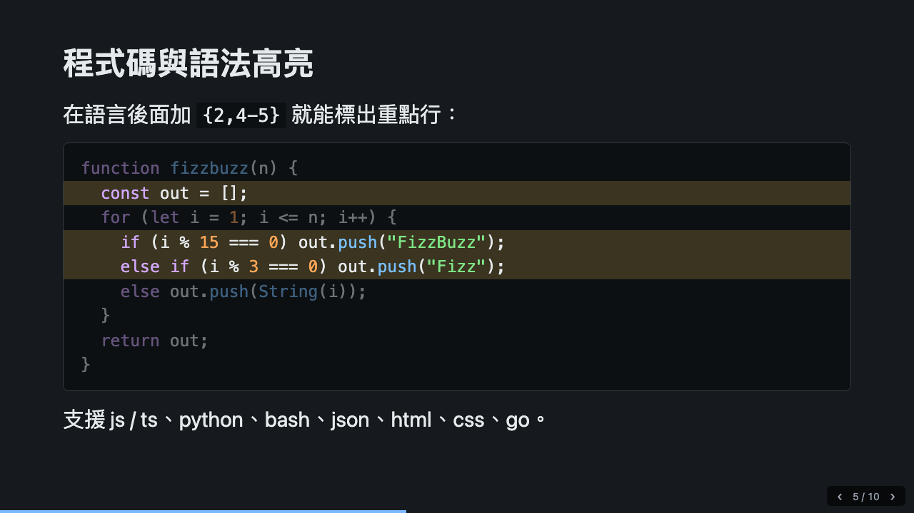
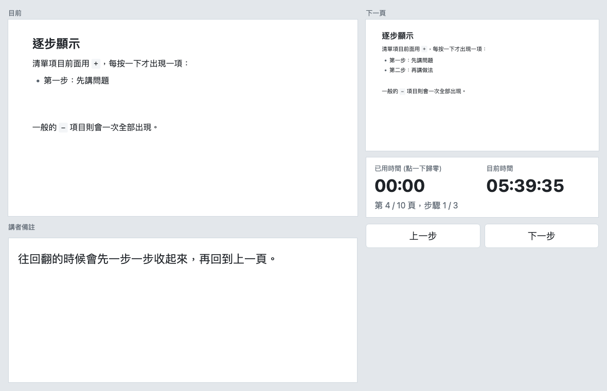

# mdslides

Turn one Markdown file into a single-file HTML slide deck, with zero dependencies.

mdslides 把一份 Markdown 變成**單一 HTML 檔**的簡報。圖片、CSS、JS 全部內嵌，沒有 CDN，雙擊就能播，寄給別人也不會壞。Markdown 解析器、語法高亮、播放器都是自己寫的，執行期不依賴任何套件。

線上範例簡報：<https://useless-husband.github.io/mdslides/examples/intro.html>（用 ← → 換頁，按 o 看總覽、s 開簡報者模式）



## 功能

- 自己寫的 Markdown 解析器：標題、段落、粗體／斜體／刪除線／行內程式碼、連結、圖片、有序／無序／巢狀清單、任務清單、引用、程式碼區塊、表格（含對齊）、水平線
- 本機圖片建置時轉成 base64 內嵌，輸出永遠是一個檔案
- 預設把 Markdown 裡的原始 HTML 跳脫（防 XSS），`--allow-html` 才放行；`javascript:` 之類的連結一律擋掉
- 投影片語法：`---` 分頁、`Note:` 講者備註、front matter、`<!-- .slide: class="center" -->` 單頁設定、`+` 逐步顯示
- 程式碼語法高亮（js/ts、python、bash、json、html、css、go），可指定高亮行 ` ```js {2,4-5} `
- 播放器：方向鍵／空白／PageUp／PageDown、Home／End、觸控滑動、總覽模式、全螢幕、黑屏、網址 `#/5` 直接連結、自動依視窗縮放
- 簡報者模式：新視窗顯示目前頁、下一頁、講者備註、計時器與時鐘，兩個視窗用 BroadcastChannel 同步
- 列印成 PDF：每頁一張投影片，`--print-notes` 可把備註印在每頁下面
- 三個實色主題：light、dark、paper，可用 `--css` 追加自訂 CSS
- `serve` 模式：本機預覽，存檔就自動重新載入

| 總覽模式 | 深色主題 |
|:--|:--|
|  |  |



## 安裝與執行

需要 [Node.js](https://nodejs.org/) 20 或更新版本。先在終端機輸入 `node --version` 確認。

### 方法一：不用安裝，直接用 npx

到放 Markdown 的資料夾，執行：

```bash
npx github:useless-husband/mdslides talk.md
```

會在旁邊產生 `talk.html`，用瀏覽器打開就能播。還沒有 `talk.md` 的話，先產生一份範例：

```bash
npx github:useless-husband/mdslides init
npx github:useless-husband/mdslides serve talk.md
```

### 方法二：git clone

```bash
git clone https://github.com/useless-husband/mdslides.git
cd mdslides
node bin/mdslides.js init talk.md
node bin/mdslides.js serve talk.md --port 18080
```

然後用瀏覽器開 <http://127.0.0.1:18080/>。改 `talk.md` 並存檔，瀏覽器會自己重新載入。

想直接輸入 `mdslides` 這個指令的話，在專案資料夾執行一次 `npm link`。

## 使用範例

### 寫一份簡報

`talk.md`：

````markdown
---
title: 我的簡報
author: 小明
theme: paper
aspect: 16:9
---

<!-- .slide: class="title" -->

# 我的簡報

小明 · 2026

Note: 開場先自我介紹，30 秒。

---

## 三個重點

+ 第一點：按一下才出現
+ 第二點：再按一下
+ 第三點：最後一項

---

## 程式碼

```js {2}
function add(a, b) {
  return a + b;
}
```

| 名稱 | 說明 |
|:-----|-----:|
| a    |    1 |
````

### 常用指令

```bash
# 產生單一 HTML 檔
mdslides talk.md -o talk.html

# 換主題、比例，追加自己的 CSS
mdslides talk.md --theme dark --aspect 4:3 --css my.css

# 本機預覽（存檔自動重新載入）
mdslides serve talk.md --port 18080

# 產生範例簡報
mdslides init talk.md
```

完整選項：

| 選項 | 說明 |
|:-----|:-----|
| `-o, --out <檔案>` | 輸出檔，預設是 `talk.html`；`-o -` 輸出到標準輸出 |
| `--theme <名稱>` | `light`、`dark`、`paper`，優先於 front matter |
| `--aspect <比例>` | `16:9`、`16:10`、`4:3` |
| `--css <檔案>` | 追加自訂 CSS，可重複使用 |
| `--print-notes` | 存成 PDF 時把講者備註印在每頁下面（改成 A4 直向） |
| `--allow-html` | 放行 Markdown 裡的原始 HTML（預設會跳脫） |
| `--no-inline-images` | 不要把本機圖片轉成 base64 |
| `--port <n>` | `serve` 用的埠，預設 8080；`0` 表示讓系統挑 |
| `--host <位址>` | `serve` 綁定的位址，預設 `127.0.0.1` |

### 語法速查

| 想做的事 | 寫法 |
|:---------|:-----|
| 分頁 | 單獨一行的 `---`（程式碼區塊裡的不算） |
| 講者備註 | 一行以 `Note:` 開頭，後面到該頁結束都是備註（也可用 `Notes:`、`備註：`） |
| 逐步顯示 | 清單項目用 `+` 開頭，一般 `-` 項目則一次全部出現 |
| 高亮程式碼行 | ` ```js {2,4-5} ` |
| 單頁設定 | `<!-- .slide: class="center" id="x" bg="#fff" -->` |
| 內建版面 | `center`、`title`、`small`、`cols`（兩欄）、`invert` |
| 任務清單 | `- [x] 完成`、`- [ ] 未完成` |

front matter 可用的欄位：`title`、`author`、`date`、`theme`、`aspect`、`lang`。

### 播放時的按鍵

| 按鍵 | 功能 |
|:-----|:-----|
| 空白、→、↓、PageDown | 下一步（有逐步項目時先顯示項目） |
| ←、↑、PageUp | 上一步 |
| Home、End | 第一頁、最後一頁 |
| o | 總覽模式（方向鍵選取，Enter 或點一下進入） |
| f | 全螢幕 |
| b | 黑屏 |
| s | 簡報者模式（新視窗，記得允許彈出視窗） |
| t | 循環切換三個主題 |

手機或平板上，左右滑動換頁。網址 `#/5` 代表第 5 頁，`#/5/2` 代表第 5 頁的第 2 步。

### 存成 PDF

用 Chrome 開啟產生的 HTML，按 Ctrl／Cmd + P，目的地選「另存為 PDF」，邊界選「無」，勾選「背景圖形」。每一頁投影片會是一頁 PDF。想要附上備註的講義版，建置時加 `--print-notes`。

## 專案結構

```
mdslides/
├── bin/mdslides.js        命令列入口
├── src/
│   ├── cli.js             參數解析與 build / serve / init 子指令
│   ├── markdown.js        Markdown 解析器（區塊 + 行內）
│   ├── highlight.js       語法高亮 tokenizer
│   ├── slides.js          front matter、分頁、備註、單頁設定
│   ├── render.js          組出完整的單檔 HTML
│   ├── server.js          預覽伺服器（fs.watch + SSE）
│   ├── templates.js       `init` 產生的範例
│   ├── index.js           當函式庫用時的匯出
│   └── assets/
│       ├── base.css       投影片、總覽、簡報者模式樣式
│       ├── themes.css     light / dark / paper 三組顏色
│       └── player.js      內嵌在輸出檔裡的播放器
├── test/                  node --test 測試
├── examples/              intro.md 與產生的 intro.html
└── docs/                  README 用的截圖
```

## 跑測試

不需要 `npm install`，沒有任何依賴：

```bash
npm test
```

或直接執行 `node --test test/*.test.js`。測試涵蓋 Markdown 解析（含 XSS 案例）、語法高亮、分頁與備註切割、front matter、CLI 端到端，以及 `serve` 模式（用 port 0 啟動，確認能回應，並在檔案變更時送出 reload 事件）。

範例簡報要重新產生的話：

```bash
npm run example
```

## 原理簡介

1. `slides.js` 先剝掉 front matter，再逐行掃過內容，遇到單獨一行的 `---` 就分頁，遇到 `Note:` 就把後面切成備註。掃描時會記得目前是否在程式碼區塊裡，所以程式碼裡的 `---` 和 `Note:` 不會被誤判。
2. `markdown.js` 逐行解析區塊（標題、清單、表格、引用、程式碼），清單靠縮排遞迴解析；行內語法用一個字元一個字元的掃描器處理，遇到 `**`、`*`、`` ` ``、`[` 時往後找配對的結尾。所有輸出的文字都會跳脫，連結網址會過濾 `javascript:` 等危險協定。
3. `highlight.js` 是一個簡單的掃描器：依語言的設定表辨識註解、字串、數字、關鍵字，HTML 與 CSS 各有專用的掃描器（HTML 內的 `<script>`、`<style>` 會遞迴交給 js / css）。它不是完整的語法分析，遇到少見寫法可能上錯色，但不會弄壞輸出。
4. `render.js` 把每一頁包成固定 1280×720（或 1024×768）的 `<section>`，連同 CSS 與播放器一起寫進同一個 HTML。播放時整個 `#deck` 用 CSS transform 縮放到視窗大小，所以字級和排版在任何螢幕上都一樣。
5. 簡報者模式是同一個 HTML 用 `?presenter=1` 開新視窗，兩邊透過 `BroadcastChannel` 傳「第幾頁、第幾步」來同步。
6. `serve` 每次請求都重新建置，並用 `fs.watch` 監看資料夾；檔案變動時，透過 Server-Sent Events 通知頁面重新載入。

## 已知限制

- Markdown 只實作常用子集：沒有參照式連結（`[text][id]`）、縮排式程式碼區塊、腳註、巢狀的複雜強調組合。
- 語法高亮是簡易版，不處理模板字串內的 `${}` 巢狀、heredoc 等情況。
- 內容超出一頁時會被裁掉，不會自動縮小，請自行分頁或加 `small` 版面。
- 簡報者模式需要瀏覽器支援 `BroadcastChannel`，且兩個視窗要同一個網址來源。

## 授權

[MIT](LICENSE) © 2026 useless-husband
